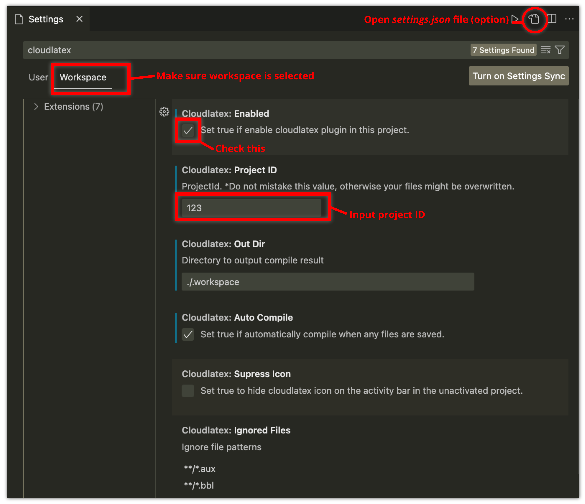

# Cloud LaTeX Extension for Visual Studio Code
<span style="font-size: 18px; font-weight: bold;">開発中のプラグインです。重要なプロジェクトには使用しないでください。</span>

<!--
＊このプラグインはbetaバージョンです。バグの報告は、[issues](https://github.com/cloudlatex-team/cloudlatex-vscode-extension/issues)で受け付けています。
また、プルリクエストも歓迎しています。
-->

# 特徴
- ローカルPCにtexliveをインストールすることなくVSCodeで編集したtexファイルをコンパイル可能に
- [Cloud LaTeX](https://cloudlatex.io/)公式VSCodeプラグイン
- ローカル上のファイルとCloud LaTeXサーバ上のファイルを自動同期
- オフラインにも対応 (オンライン復帰時に自動同期)

# インストール
[Visual Studio Marketplace](https://marketplace.visualstudio.com/items?itemName=cloudlatex.cloudlatex)からインストール、あるいはクイックオープン(`ctrl/cmd + P`)に `ext install cloudlatex` と入力します.

# 準備
0. Cloud LaTeXのアカウントを持っていない場合は、[Cloud LaTeX](https://cloudlatex.io/)からアカウントを作成します。
1. [プロジェクト一覧](https://cloudlatex.io/projects)の右上のユーザ名をクリックし、上から3つ目のプラグイン連携を選択する。トークン生成ダイアログが表示されるので、アカウント情報を入力し、生成されるクライアントID、トークンを記録します。
2. [プロジェクト一覧](https://cloudlatex.io/projects)からプロジェクトを作成します。
3. 作成したプロジェクトのプロジェクトIDをURLより記録します。例: `/projects/123/edit` -> プロジェクトIDは `123`

# 設定
ローカルに空のVSCode用プロジェクトを作成します。
[Activity Bar](https://code.visualstudio.com/docs/getstarted/userinterface)に表示される`CL`アイコンをクリックするとSide Barに二つのボタンが表示されます。

`Set account`ボタンをクリックし、`email`, `client`, `token` を設定します。
アカウントの設定は、コマンドパレット(mac: `Cmd+Shift+P`, win: `Ctrl+Shift+P`)で`cloud LaTeX: Set account` コマンドからも可能です。


次に`Project setting` ボタンをクリックし表示される項目のうち、
`Cloudlatex.projectID` に準備の項で確認した値を設定し、
`Clodulatex.Enabled` にチェックを付けます。


＊ `User` タブではなく、`Workspace` タブに設定を行う必要があります。




プロジェクトの[settings.json](https://code.visualstudio.com/docs/getstarted/settings)から設定することも可能です。

```settings.json
{
  "cloudlatex.projectId": 127,
  "cloudlatex.enabled": true,
  "cloudlatex.outDir":  "./.workspace",
}
```

[LaTeX Workshop](https://marketplace.visualstudio.com/items?itemName=James-Yu.latex-workshop)と併用することで、pdfのレビューやコマンド補完などが使えるようになります。
この場合、以下の設定を追加し、Latex Workshopの自動コンパイルを無効化してください (`latex-workshop.latex.outDir`は `cloudlatex.outDir` と同じ値に設定します)。
```setting.json
{
  "latex-workshop.latex.autoBuild.run": "never",
  "latex-workshop.latex.outDir": "./.workspace",
}
```

設定ファイルを変更すると、VSCodeを再起動するよう促すダイアログが表示されるので、ダイアログ中のダイアログ中の `Restart VSCode` ボタンを押して再起動します。
再起動後、プロジェクトファイルがダウンロードされます。
ダウンロードが成功すると、ファイル同期に成功した旨のダイアログが表示されます。

＊ プロジェクトを同期しなおす際には、同期中にローカルのファイルを削除しないように注意してください。(サーバのファイルも削除されます)　また、　同じローカルディレクトリ内で同期するプロジェクトを変更する際には、ローカルファイルが予期せず上書きされないように注意してください。（projectIdを変更して同期を行うと、元のローカルファイルは上書きされます）

＊ プロジェクトファイルがダウンロードされない時は、`reload`ボタンをクリックするか、一旦vscodeを閉じ、再度開いてみてください

# ファイルの同期とコンパイル
オンラインの際にはローカルで行ったでファイルの変更が自動で同期されます。
Cloud LaTeXのwebアプリから行ったファイルの変更もローカルに反映されます。

`Project setting` で `cloudlatex.autoCompile` にチェックを入れることで、ファイル保存時に自動でコンパイルが行われます。
CLアイコンをクリックすることで表示されるサイドパネルの、 `Compile` ボタンからコンパイルすることも可能です。
コンパイル完了後、`Project setting` の `cloudlatex.outDir` に設定したディレクトリ以下にpdfがダウンロードされます。

## ファイルのコンフリクト
同一のファイルをローカルとサーバ(Cloudlatex Webエディタ、あるいはDropbox連携機能)の両方で編集すると、ファイルのコンフリクトが発生します。コンフリクトが発生すると、ローカルかサーバ、いずれかの変更に合わせる必要があります。

コンフリクトを検知すると、以下のダイアログが表示されます。


`Resolve conflict` ボタンを押し、`Pull` か `Push` を選択します。


- Pull: サーバの変更をダウンロードし、サーバに合わせます
- Push: サーバにローカルの変更をアップロードすることで、ローカルに合わせます


# トラブルシューティング

## 「`error in syncSession: ...`」 というエラ〜メッセージが表示され、ファイルの同期が完了しない
リモートサーバとのファイルの同期が失敗しています。
Cloud LaTeX webアプリのプロジェクトにアクセスし、コンパイルターゲットが設定されていない等の問題がないか確認してください。
また、ローカルに不正なファイル（.から始まるファイル、LaTeXで利用されない拡張子を持つファイル等）が存在しないか確認し、存在する場合は削除してください。
問題が解決しない場合、コマンドパレット(mac: `Cmd+Shift+P`, win: `Ctrl+Shift+P`)を開き、`cloud LaTeX: Reset local` コマンドを実行し、強制的にローカルファイルの状態をサーバの状態に合わせることが可能です (注: サーバに同期されていないローカルファイルの変更点は失われます)。

## コンパイル時に「`Target file is not found`」というエラーメッセージが表示される
コンパイルターゲットに指定したファイル名を変更または削除すると、コンパイルができなくなります。その場合、Cloud LaTeX webアプリよりコンパイルターゲットを設定しなおしてください。

## 起動時に「Be sure to set cloudlatex.enabled to true ...」というエラーメッセージが表示される
`Project setting`の `User` タブの `cloudlatex.autoCompile` のチェックを外してください。(`Project` タブの`cloudlatex.autoCompile` にのみチェックを入れる必要があります)

# 注意事項
- VSCodeでプロジェクトを開いている時にのみファイルの同期が行われます。そのため、プロジェクトを開いていない際に行ったファイル操作は同期されません。

# ソースコード
https://github.com/cloudlatex-team/cloudlatex-vscode-extension/tree/master

# ライセンス
Apache License 2.0
